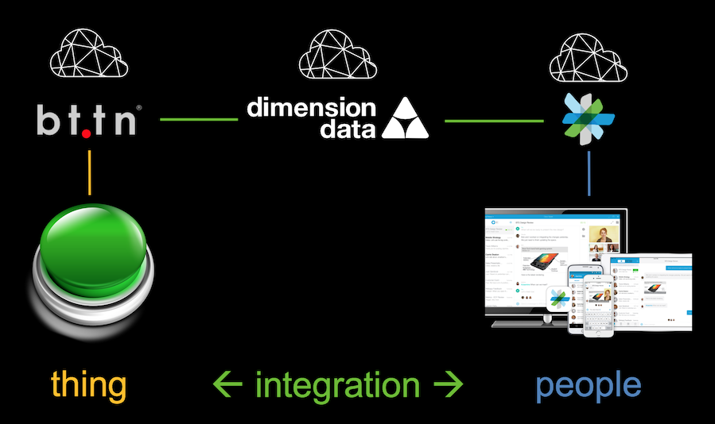
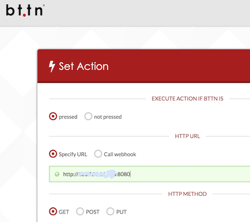

# bt.tn-spark
Press a bt.tn, multiple times, to foster digital interactions in Cisco Spark and over Twilio. This project implements a software robot (a bot) that turn signals received from the button to meaningful updates for the human beings.



## What do you need to run this bot?

* a green button that can trigger a web link, like one of [the smart products from bt.tn](https://bt.tn/shop/) for example
* a server to run the bot, for example a small Cloud Server at the Managed Cloud Platform from Dimension Data
* a token for your bot, provided by [Cisco Spark for Developers](https://developer.ciscospark.com/index.html)
* credentials at [Twilio](https://www.twilio.com) to use their communication services (SMS and voice)
* some instructions and goodwill :-)

## What can this bot really do?

The bot can:
* create a Cisco Spark room
* add moderators and participants
* upload binary files
* post messages formatted in Markdown
* send SMS over Twilio
* call phone numbers over Twilio and say something

You do not need to be a software developer to use this bot. The behaviour of the bot is set in a straightforward configuration file named `settings.yaml`, so have a look at it and adapt it to your needs.
The sample configuration file below provides a rather good idea of what this bot is capable of.

```yaml
# the sequence of responses given to each button press
#
bt.tn:

  # first press of bt.tn
  #
  - markdown: |
        Green Power has been invoked again
        ==================================

        The [green button](https://d2jaw3pqpetn6l.cloudfront.net/app/uploads/2016/05/27125600/product-images-bttn-normal-green-600x600.jpg) has been pressed, so there is a need for collective action.

        Some context to this event: *Italic*, **bold**, and `monospace`.
        Itemized lists look like this:

          * this one
          * that one
          * the other one

        Unicode is supported. ㋡ Presss the button again to transition to next level of assistance.

    file: files/dashboard.png
    type: "image/png"
    label: "Current status of the server"

  # second press of bt.tn
  #
  - sms:
      - message: "Check Cisco Spark"
      - number: "+352691496401"

    markdown: |
        The button has been pressed again, so you may need more information on our processes.
        Reference information can be found here: [Incident Management](https://en.wikipedia.org/wiki/Incident_management_(ITSM))

        Aside from information already shared in this room, you may want to capture more facts and share these with us.
        Please print and fill the form below. Call our Global Service Center at [+44 12 34 56 78](tel:+44-12-34-56-78) for any real-time assistance you may need. Press the button again to escalate.

    file: files/IncidentReportForm.pdf
    type: "application/pdf"
    label: "Print and fill this form"

  # third press of bt.tn
  #
  - call:
      - number: "+352691496401"
      - say: "Hello, please check Cisco Spark. There is an on-going escalation"

    markdown: |
        A real-time telephone call is taking place right now.

  # fourth press of bt.tn
  #
  - file: files/dimension-data.png
    type: "image/png"
    label: "Build new integrated systems and manage them"

  # fifth press of bt.tn
  #
  - file: files/spark.png
    type: "image/png"
    label: "Cisco Spark brings things and human beings together"


# Cisco Spark settings
#
spark:

    # the name of the Cisco Spark room
    #
    room: "Green Power Demonstration"

    # pre-defined moderators
    #
    moderators:
      - bernard.paques@dimensiondata.com
      - nemo.verbist@dimensiondata.com

    # pre-defined participants
    #
    participants:
      - laurent.vogt@dimensiondata.com
      - david.hubert@dimensiondata.com

    # the token that has been created for this bot should normally be set in
    # the environment but you can override the configuration below
    #
    # CISCO_SPARK_BTTN_BOT: "<token here hkNWEtMJNkODk3ZDZLOGQ0OVGlZWU1NmYtyY>"


# Twilio settings
#
twilio:

    # customer service number
    #
    customer_service_number: "33644606827"

    # the account sid from https://www.twilio.com/console
    #
    # TWILIO_ACCOUNT_SID: "<sid_here>"

    # the authentication token from https://www.twilio.com/console
    #
    # TWILIO_AUTH_TOKEN: "<token_here>"


# server settings
#
server:

    # the port from which this bot is getting requests from the internet
    #
    port: 8080

    # the url that is used to access this server remotely, e.g. with ngrok
    #
    #url: "http://b2db306e.ngrok.io/"
```

## Ok, tell me the sequence of operations

### Step 1. Get a physical button that can generate web requests.

I acquired a large green button from bt.tn,
and then paired it with my smartphone over private WiFi.


### Step 2. Declare a bot at Cisco Spark for Developer, then save the precious token that is given in return.

I saved this token as `CISCO_SPARK_BTTN_BOT` in the environment of my workstation, so that it is not in
any configuration file.


### Step 3. Get and configure a small public web server.

If you have to go the manual way, then first secure a Ubuntu machine and consider following steps.

```bash
$ sudo apt-get install -y ntp git python-pip
$ cd /home/ubuntu/
$ git clone https://github.com/bernard357/bt.tn-spark.git
$ cd bt.tn-spark/
$ pip install -r requirements.txt
$ export CISCO_SPARK_BTTN_BOT="<whatever_your_spark_token_is>"
$ export TWILIO_ACCOUNT_SID="<account_sid_from_twilio>"
$ export TWILIO_AUTH_TOKEN="<auth-token_from_twilio>"
$ export BTTN_URL="<public_url_for_this_server>"
$ python hook.py
```

Else if you have some MCP credentials, you may want to clone this GitHub
repository on your workstation, and then run plumbery: `python -m plumbery fittings.yaml deploy`


### Step 4. Activate the bot.

Connect to your server over SSH in a terminal window, then run the server in the foreground:
`python hook.py` Log messages are pretty comprehensive, so it should easy to monitor how things are going.


If you have used plumbery at the previous step, just follow instructions on screen.

### Step 5. Configure the button to use the public IP address of the web server.

For this I used the straightforward console provided by bt.tn. It took me about 1 minute or 2.




### Step 6. Now launch Cisco Spark and press the button.

After some seconds you should get a new room on screen, and a first update in Markdown.
The button should return to quiet state (no led), and the log of the server should report that everything is ok.


Congratulations! Hit the button again, to demonstrate how the bot can cleverly manage multiple states.

If you use `settings.yaml` out of the box, then on second push a SMS message will be sent, and on third push a phone call
will take place.


## Feedback: Help! This is not working as expected

Of course, it would have been too easy otherwise. As an engineer, you expect some brain activity and creativity, right? Please check in sequence the transmission chain to spot the culprit, and fix it.

## Feedback: This does provide a comprehensive demonstration in 25 minutes or less. Awesome

Good news :-)  After the demonstration, destroy cloud resources with: `python -m plumbery fittings.yaml destroy` and bring the precious button with you.

We are glad to receive contributions and comments via GitHub. Thanks for cloning this repository and for the submission of your next pull request.
